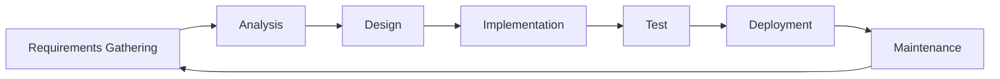

# 01 — Foundations — Deep Technical Guide

> A comprehensive technical reference for building software — the foundational concepts, patterns, and best practices that every developer should know.

---

## 1. Core Concepts

### 1.1 Software Engineering Principles

| Principle | Description | Practice |
|---|---|---|
| **YAGNI** | "You Aren't Gonna Need It" — build only what is needed now | Refuse extra features, keep designs simple |
| **DRY** (Don't Repeat Yourself) | No duplication — extract shared logic | Single source of truth, DRY templates |
| **KISS** (Keep It Simple, Stupid) | Simplicity over complexity — prioritize readability | Avoid over-engineering, favor clarity |
| **Single Responsibility** | Each module should have one reason to change | Pure functions, single-purpose classes |
| **Progressive Complexity** | Complexity grows at a controlled rate | Add features incrementally, review changes |

### 1.2 Software Development Life Cycle (SDLC)



| Phase | Description |
|---|---|
| **Requirements** | Gather and document functional and non-functional requirements |
| **Analysis** | Decompose requirements into use cases, data models, and architecture |
| **Design** | Define system architecture, component interfaces, data flow |
| **Implementation** | Write code against the design |
| **Test** | Write tests for all code paths, perform regression testing |
| **Deployment** | Package and deploy the application |
| **Maintenance** | Support, bug fixes, updates |

### 1.3 Design Patterns

| Pattern | When to Use | Description |
|---|---|---|
| **Strategy** | Operations vary by context | Define a family of algorithms and select at runtime |
| **Observer** | Events and notifications | Register listeners for events, fire-and-forget |
| **Factory** | Creating objects | Abstract creation logic behind a factory method |
| **Adapter** | Interoperability | Wrap legacy interfaces with a compatible API |
| **Decorator** | Adding behavior | Wrap objects with additional responsibilities |
| **Singleton** | Single global instance | When exactly one instance is needed throughout the app |

---

## 2. Key Patterns & Architectures

### 2.1 Module Design

```typescript
// Pure logic module
export function processData(input: RawData): ProcessedData {
    // Pure function — no side effects, deterministic
    return {
        id: input.id,
        processed: transform(input),
    };
}

// Service layer
export async function handleRequest(input: Request): Promise<Response> {
    try {
        const result = await process(input);
        return { success: true, data: result };
    } catch (error) {
        return { success: false, message: (error as Error).message };
    }
}

// Repository pattern — data access
export interface DataRepository {
    async find(id: number): Promise<Entity>;
    async create(data: CreateInput): Promise<Entity>;
}

export class SqlRepository implements DataRepository {
    constructor(private db: Database) {}

    async find(id: number): Promise<Entity> {
        return this.db.prepare("SELECT * FROM entities WHERE id = ?").get(id);
    }

    async create(data: CreateInput): Promise<Entity> {
        const result = await this.db.prepare(`
            INSERT INTO entities (name, description)
            VALUES (?, ?)
        `).run(data.name, data.description);

        return this.find(result.lastInsertRowid as number);
    }
}

// API gateway — unified entry point
export class ApiGateway {
    constructor(
        private userService: UserService,
        private productService: ProductService,
        private logger: Logger,
    ) {}

    async handleRequest(request: IncomingRequest): Promise<ApiResponse> {
        try {
            const method = request.method;
            const path = request.path;
            const body = request.body;

            if (path === '/users') {
                if (method === 'GET') return this.userService.list(body);
                if (method === 'POST') return this.userService.create(body);
            }

            throw new Error('Not found');
        } catch (error) {
            this.logger.error({ error }, 'API request failed');
            return { success: false, message: (error as Error).message };
        }
    }
}
```

### 2.2 Event-Driven Architecture

```typescript
// Event-driven pattern
export interface AppCreatedEvent {
    id: number;
    userId: number;
    createdAt: Date;
}

export class AppCreatedEventEmitter {
    constructor(
        private db: Database,
        private logger: Logger,
    ) {}

    async emit(event: AppCreatedEvent): Promise<void> {
        // 1. Store event
        await this.db.prepare(`
            INSERT INTO events (type, payload)
            VALUES (?, ?)
        `).run(event.constructor.name, JSON.stringify(event));

        // 2. Send notification
        this.logger.info({ event }, 'App created');

        // 3. Invoke handlers
        const handlers = this.getHandlers(event.constructor.name);
        for (const handler of handlers) {
            await handler(event);
        }
    }

    private getHandlers(eventType: string): ((event: AppCreatedEvent) => Promise<void>)[] {
        // Resolve handlers from a configuration
        return [
            this.handleUserCreated,
            this.handleNotification,
        ];
    }
}

// Example handler
AppCreatedEventEmitter.prototype.handleUserCreated = async (event: AppCreatedEvent) => {
    // Send welcome email
    await sendEmail({
        to: event.userId,
        subject: 'Welcome!',
        body: 'Thanks for creating an account!',
    });
};
```

---
